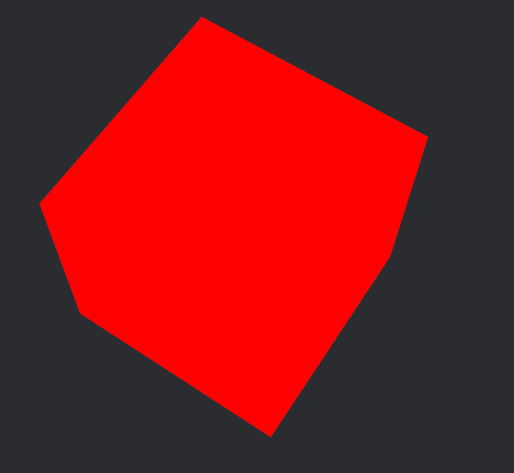
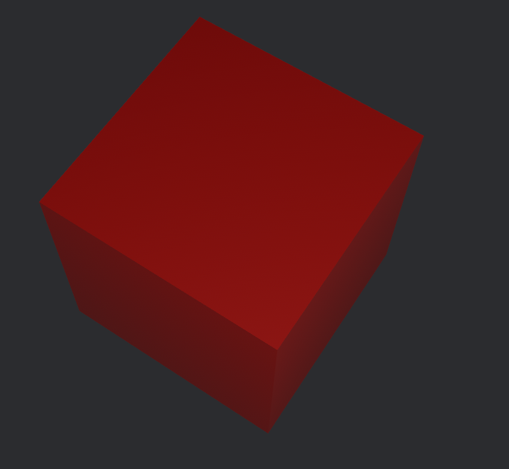

{{#include ../include/header012.md}}

If we were to run the WGSL code from the previous page, 
```c
#import bevy_pbr::{
    mesh_view_bindings::globals,
    forward_io::VertexOutput,
}

@fragment
fn fragment(in: VertexOutput) -> @location(0) vec4<f32> {
    // (r, g, b, a)
    return vec4<f32>(1.0, 0.0, 0.0, 1.0);
}
```

If we were to run the above program, we would see a beautiful red cube.  



Okay, cool!  
So we can mess with that returned color to get whatever specific color we want.
... But where's the lighting?  
We added a pointlight to the code, if you take a glance back.  

In fact, if we were to do the *normal* method of creating a material of a single color  
(changing the code temporarily to):

```rust
fn setup(
    mut commands: Commands,
    mut meshes: ResMut<Assets<Mesh>>,
    mut cmaterials: ResMut<Assets<CustomMaterial>>,
    mut materials: ResMut<Assets<StandardMaterial>>,
) {
	// ...

	commands.spawn(MaterialMeshBundle {
        mesh: meshes.add(Mesh::from(shape::Box::new(2.0, 2.0, 2.0))),
        material: materials.add(Color::rgb(1.0, 0.0, 0.0).into()),
    // ...
```

We would see:  



Which loks much more how you'd expect a red cube with light to look!

The answer to 'why' is simply that we are using a custom shader + material, rather than the default material.  
The default shader for `StandardMaterial`s processes lighting information along with the color. Specifically, our conversion of `Color` into a `StandardMaterial` is just setting the `base_color` and leaving all other fields as their defaults.  
  
We will cover how to make your shaders behave like standard ones soon enough. For now, we are going to focus on how to have more control over what is rendered.