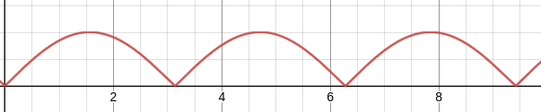
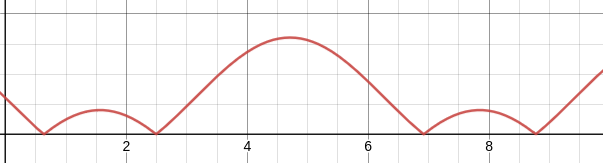
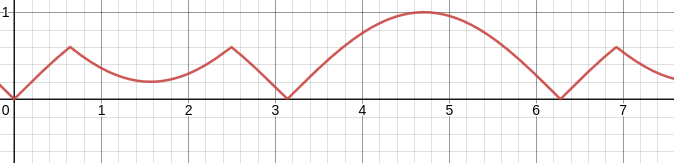
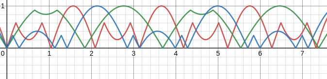

{{#include ../include/header012.md}}

# Flashing

Time.
The `mesh_view_bindings::globals` is exported+defined in  [mesh\_view\_bindings.wgsl](https://github.com/bevyengine/bevy/blob/1523e8c4092ad61f7c949c331b5ff735ad797dff/crates/bevy_pbr/src/render/mesh_view_bindings.wgsl#L34), though the *type* that is the `Globals` structure [globals.wgsl](https://github.com/bevyengine/bevy/blob/1523e8c4092ad61f7c949c331b5ff735ad797dff/crates/bevy_render/src/globals.wgsl) which is constructed by [prepare_globals_buffer](https://github.com/bevyengine/bevy/blob/1523e8c4092ad61f7c949c331b5ff735ad797dff/crates/bevy_render/src/globals.rs#L69).  

You don't *have* to dig through Bevy's definitions to use much of what you'll learn, but gaining the ability to look up definitions for what you want is very useful!  
From the comments on the structure:
```C
struct Globals {
    // The time since startup in seconds
    // Wraps to 0 after 1 hour.
    time: f32,
    // The delta time since the previous frame in seconds
    delta_time: f32,
    // ...
```

Let's say we want to make a flashing material for our cube. This could be used for a strange flickery light, or as an aesthetic for your Tron fan-game.  
What should you use?  

`delta_time` would be the typical piece you'd use for *movement* in your game, as it allows you to ensure that your movement is framerate-independent.  
The `time` field is what we want for our flashing material.  
Shaders don't have kept state across executions (at least usually). We don't have an input to our shader which goes 'this was 90% red the previous frame' for us to then do 'it has been 0.01s, please update with delta change of red'. You could do this, and delta time would be the way to do it, but that is not the most natural for many shaders.

One way of looking at the problem is that a shader should run in ~mostly isolation with its inputs. We could do fancy stuff to pass in the previous colors, but it simpler to just use the given `time`.  
But, how do we make the fragment shader flash on and off? Well, the simplest method is to use some sort of periodic function. Like `sin`!

```c
@fragment
fn fragment(in: VertexOutput) -> @location(0) vec4<f32> {
    let red = abs(sin(globals.time));
    return vec4<f32>(red, 0.0, 0.0, 1.0);
}
```

This will give you a cube that moves between black and red.
// TODO: add gif


The `abs` ensures the value is always positive. It would behave fine with negative values, it would simply have a longer period of being completely black.  

Remembering some math, we can get: \\(A \cdot \sin(B \cdot t + C) - D\\) where
- \\(A\\) is the amplitude (scale vertically)
- \\(B\\) is the frequency (scale horizontally)
- \\(C\\) is the phase shift (move horizontally)
- \\(D\\) is the vertical shift (move vertically)

The amplitude is not too useful for us here, as we want to go from 0 to 1 for color.  
Frequency is notably usefu! It lets us speed up or slow down how often the flashes occur. Let's crank that up to \\(3\\).

```c
let red = abs(sin(3.0 * globals.time));
```

The phase shift is not much use. If you were doing a longer lasting strobe light, then you could use the shift to ensure it started as fully bright or fully dark.

$D$ however, lets us do something interesting
```c
// ignoring B for the moment
let red = abs(sin(globals.time) - 0.6);
```
This will have it flicker on a bit, and then go back down before the light turns on fully.
// TODO: add gif


Notice a small problem here. This goes over 1.0.  
The obvious method to solve this would be to clamp the value between the range of 0.0 and 1.0. Let's do something more interesting.  
Let's shift down by \\(D\\) again, which would result in some values going negative, and then \\(\mathrm{abs}\\) that.
```c
let red = abs(abs(sin(globals.time) - 0.6) - 0.6);
```
[Desmos](https://www.desmos.com/calculator/zwbwhzra1q)  


Which is a fun little oscillation pattern, much closer to a realistic flickery light. Though still not entirely, the tallest hump is too smooth.

You can even do a similar idea with all of your colors, but at different rates!
```wgsl
let red = abs(abs(sin(3.0 * globals.time) - 0.6) - 0.6);
let green = abs(abs(sin(1.7 * globals.time) - 0.9) - 0.9);
let blue = abs(abs(sin(2.2 * globals.time) - 0.3) - 0.3);
return vec4<f32>(red, blue, green, 1.0);
```
[Desmos](https://www.desmos.com/calculator/1padr9y7os)  

// TODO: add gif