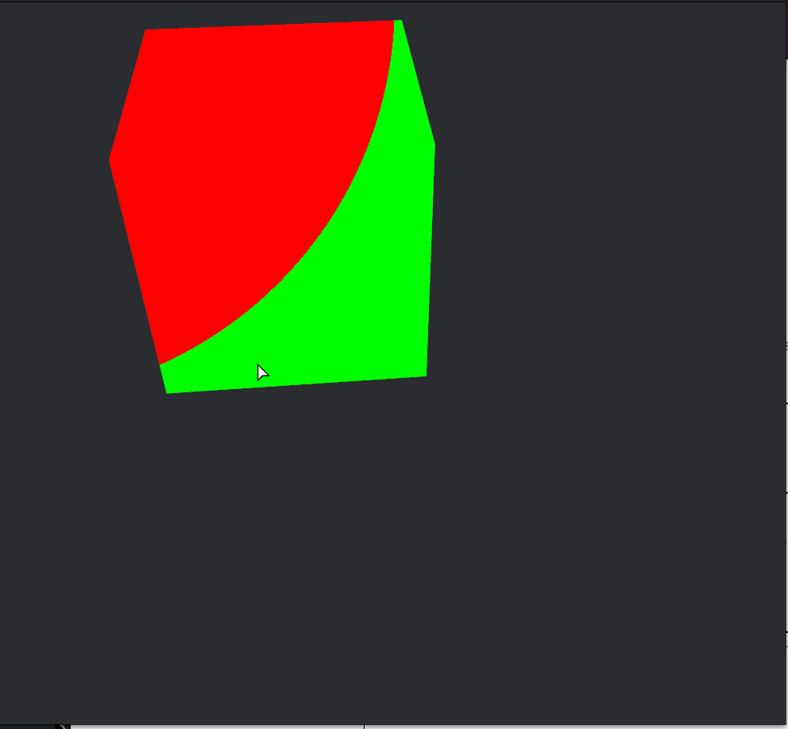
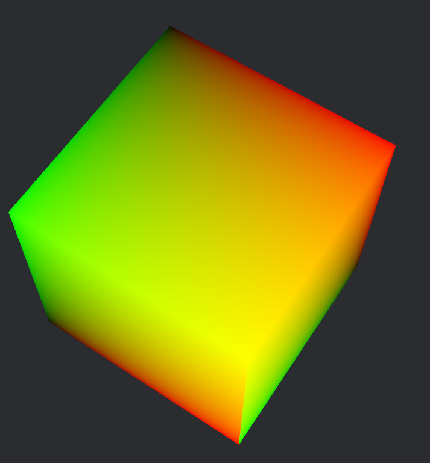

{{#include ../include/header012.md}}

# Position
So we're now able to apply colors while also shifting them around.  
But what if we don't want all of our fragments to be a single perfect color?  

Position information comes to the rescue, now letting us finally cover the `in: VertexOutput` input to our fragment shader.

[forward\_io.wgsl](https://github.com/bevyengine/bevy/blob/1523e8c4092ad61f7c949c331b5ff735ad797dff/crates/bevy_pbr/src/render/forward_io.wgsl#L30) is the relevant file. Though I'll note that `VertexOutput` is sometimes defined as custom versions in various pieces of code. The output from the vertex shader isn't completely set! This is just a common version for us to receive.
```c
struct VertexOutput {
    // This is `clip position` when the struct is used as a vertex stage output
    // and `frag coord` when used as a fragment stage input
    @builtin(position) position: vec4<f32>,
    @location(0) world_position: vec4<f32>,
    @location(1) world_normal: vec3<f32>,
#ifdef VERTEX_UVS
    @location(2) uv: vec2<f32>,
#endif
#ifdef VERTEX_TANGENTS
    @location(3) world_tangent: vec4<f32>,
#endif
#ifdef VERTEX_COLORS
    @location(4) color: vec4<f32>,
#endif
#ifdef VERTEX_OUTPUT_INSTANCE_INDEX
    @location(5) @interpolate(flat) instance_index: u32,
#endif
}
```
Alright. So `@builtin(position) position: vec4<f32>` is the basic equivalent of `gl_FragCoord` from GLSL. But its a `vec4`? What's going on there? Well, just wait because I don't know yet at the time of writing this!

The `#ifdef`s serve as a way to only include some fields if they're relevant to the shader, letting you write only one shader file that can be compiled separately for multiple purposes.

But, what is that 'clip position' that the comment references? Well it is a position in clip-space.


... And what is that?

[WebGPU Coordinate Systems](https://www.w3.org/TR/webgpu/#coordinate-systems)
The WebGPU and WGSL references are you ~~holy grails~~ sometimes helpful and suprisingly readable allies.

Vertex shaders receive their positions as model-space coordinates (mesh-local space??). The vertex shader then transforms these positions *into* clip-space coordinates.  
Fragment shaders receive Fragment coordinates, which are just viewport coordinates. That is, an `x`, `y` into the 2D framebuffer (the screen!), with a `z` for depth. Please ignore the `w` field alongside me for now.  
Since this is a 2D framebuffer, `x` increases to the right and `y` increases downwards.

```c
@fragment
fn fragment(in: VertexOutput) -> @location(0) vec4<f32> {
    // sqrt(x^2 + y^2 + z^2)
    let len = length(in.position.xyz);
    if len < 500.0 {
        return vec4<f32>(1.0, 0.0, 0.0, 1.0);
    } else {
        return vec4<f32>(0.0, 1.0, 0.0, 1.0);
    }
}
```
This will draw a red circle with its origin at \\((0, 0)\\) and a radius of \\(500\\). The cube then acts like a window to the circle drawn on the top left corner of the screen.

  
<!-- TODO: retake without borders and mouse -->

Having a material that looks like a cut out to another realm can be used for some cool effects! It is also often not what you want.


To get colors that don't care about where we're looking at them from, we can use the provided UV coordinates. `@location(2) uv: vec2<f32>`  
The first coordinate `in.uv.x` is `u`, with the `y` being `u`. Both values lie in the range \\([0, 1]\\).

If we wanted to do draw a circle in the center of the *face*, then we can use the `uv` coordinates.
If we just do:
```wgsl
return vec4<f32>(in.uv, 0.0, 1.0);
```
Then we get:


Let's actually draw a circle on the center of each face.

```c
let centered_uv = in.uv - vec2<f32>(0.5, 0.5);
let dist = length(centered_uv);
let radius = 0.5;

if dist < radius {
    return vec4<f32>(1.0, 1.0, 1.0, 1.0);
} else {
    return vec4<f32>(0.0, 0.0, 0.0, 1.0);
}
```
That is, we use \\((0.5, 0.5)\\) as the center of the circle and get the distance from that point. If the distance is within the circle (< radius) then we return white, otherwise we return black.


Decreasing the radius would of course make the circle smaller.  


Let's use our knowledge of time.  
```c
let centered_uv = in.uv - vec2<f32>(0.5, 0.5);
let dist = length(centered_uv);
let radius = abs(sin(globals.time)) / 2.0 + 0.1;

if dist < radius {
    return vec4<f32>(1.0, 1.0, 1.0, 1.0);
} else {
   return vec4<f32>(0.0, 0.0, 0.0, 1.0);
}
```
Now we have circles that shrink and expand, with a slight shift over so that they look like they touch around the edges!  
However we still have that ugly black border. Can we make that go away?  

Sure, just change the returned alpha to \\(0.0\\) when we're outside of the circle.
```c
} else {
    return vec4<f32>(0.0, 0.0, 0.0, 0.0);
}
```
*or*, you can use `discard` which is a special keyword. I'm not sure if it behaves differently?
```c
} else {
    discard;
}
```


//TODO: add gifs