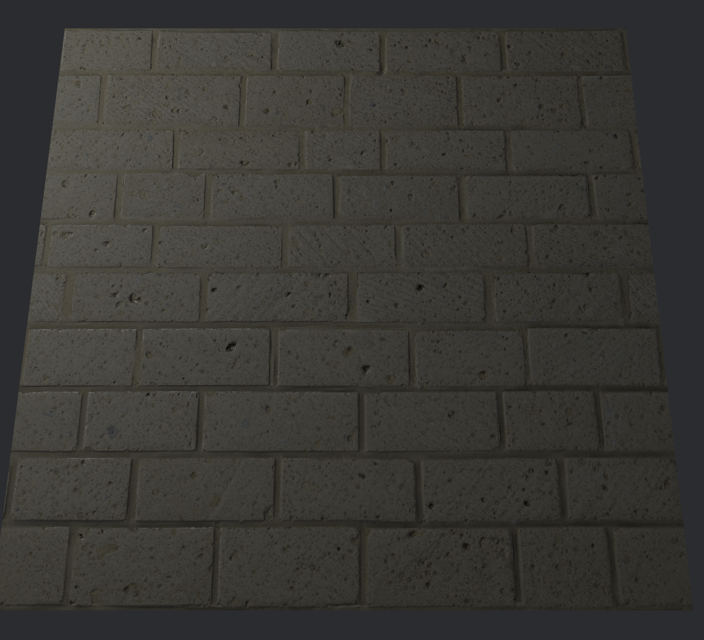
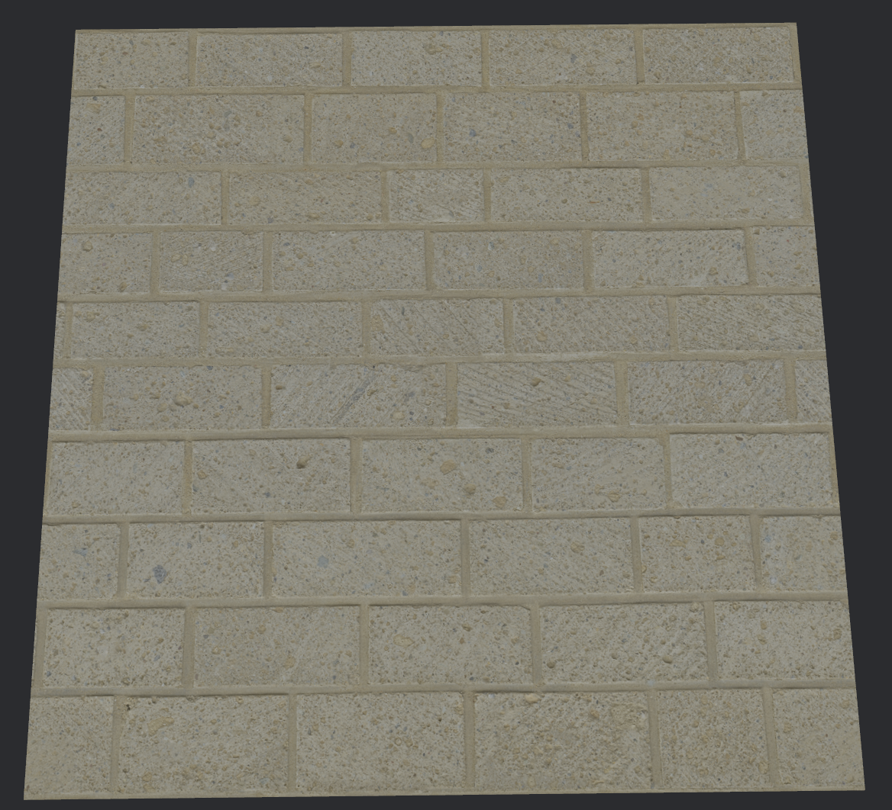

{{#include ../include/header012.md}}

# Texture
We want to render a texture on our shape!  
Well, what texture should we render?  
  
Let's grab a cool looking texture, like this white brick https://ambientcg.com/view?id=Bricks038  
Download whatever resolution you want, I'm just going with 1K! You probably want the PNG version on the right, as you have to enable the `jpg` feature in Bevy to import JPGs.  
Extract this to your assets folder. I suggest putting it in a folder like `assets/bricks038/`, you do NOT want a dozen materials' textures, normals, etc. in one folder.  
  
Now, this is a PBR material. That means the *proper* way to use this is to do:  
```rust
fn setup(
    mut commands: Commands,
    asset_server: Res<AssetServer>,
    mut meshes: ResMut<Assets<Mesh>>,
    mut cmaterials: ResMut<Assets<CustomMaterial>>,
    mut materials: ResMut<Assets<StandardMaterial>>,
) {
    // Camera
    commands
        .spawn(Camera3dBundle {
            transform: Transform::default(),
            ..default()
        })
        .insert(UnrealCameraBundle::new(
            UnrealCameraController::default(),
            Vec3::new(0.0, 10.0, 0.0),
            Vec3::new(0.0, 0.0, 0.0),
            Vec3::Y,
        ));

    commands.spawn(PointLightBundle {
        transform: Transform::from_xyz(8.0, 8.0, 4.0),
        point_light: PointLight {
            intensity: 1000.0,
            range: 40.0,
            radius: 30.0,
            ..Default::default()
        },
        ..Default::default()
    });
    commands.insert_resource(AmbientLight {
        color: Color::rgb(0.5, 0.5, 0.5),
        brightness: 0.5,
    });

    let mut mesh = Mesh::from(shape::Plane {
        size: 10.0,
        subdivisions: 0,
    });
    mesh.generate_tangents().unwrap();
    commands.spawn(PbrBundle {
        mesh: meshes.add(mesh),
        material: materials.add(StandardMaterial {
            base_color: Color::rgb(0.72, 0.72, 0.72),
            base_color_texture: Some(asset_server.load("bricks038/Bricks038_1K-PNG_Color.png")),
            metallic_roughness_texture: Some(
                asset_server.load("bricks038/Bricks038_1K-PNG_Roughness.png"),
            ),
            perceptual_roughness: 1.0,
            normal_map_texture: Some(asset_server.load("bricks038/Bricks038_1K-PNG_NormalGL.png")),
            occlusion_texture: Some(
                asset_server.load("bricks038/Bricks038_1K-PNG_AmbientOcclusion.png"),
            ),
            // I don't believe we can use displacement maps
            ..Default::default()
        }),
        ..Default::default()
    });
}
```



Beautiful! Sortof. My lighting choices aren't quite as nice, and probably we would want to somehow scale the texture down.  
(TODO: can we improve how it looks?)  
  
But we're wanting to manually put a texture on our sphere!  
  
Let's go back to our material.
```rust
    commands.spawn(MaterialMeshBundle { // note that we're using MaterialMeshBundle instead of PbrBundle
        mesh: meshes.add(mesh),
        material: cmaterials.add(CustomMaterial {
            // decent tinting so it is less unnaturally bright
            base_color: Color::rgb(0.72, 0.72, 0.72),
            texture: asset_server.load("bricks038/Bricks038_1K-PNG_Color.png"),
        }),
    // ...
}

#[derive(Asset, TypePath, AsBindGroup, Debug, Clone)]
pub struct CustomMaterial {
    #[uniform(0)]
    base_color: Color,
    #[texture(1)]
    #[sampler(2)]
    texture: Handle<Image>,
}
```
Which binds the texture to location 0 and the texture sampler to location 1.

If we want to apply the texture to our mesh, we need to alter the fragment shader.  
```c
@group(1) @binding(0) var<uniform> base_color: vec4<f32>;
@group(1) @binding(1) var base_color_texture: texture_2d<f32>;
@group(1) @binding(2) var base_color_sampler: sampler;

@fragment
fn fragment(in: VertexOutput) -> @location(0) vec4<f32> {
    return textureSample(base_color_texture, base_color_sampler, in.uv) * base_color;
}
```

This does the obvious: it samples from `base_color_texture` using the sampler at the `uv` coordinate. The `uv` is for UV mapping, which is a way to map a 2D texture onto a 3D shape, each run of the fragment shader gets a different `uv` coordinate.  
<!-- TODO: I presume sampler is GPUSampler? and so it is filtering | non-filtering | comparison? -->



The sheer unlit beauty of it.