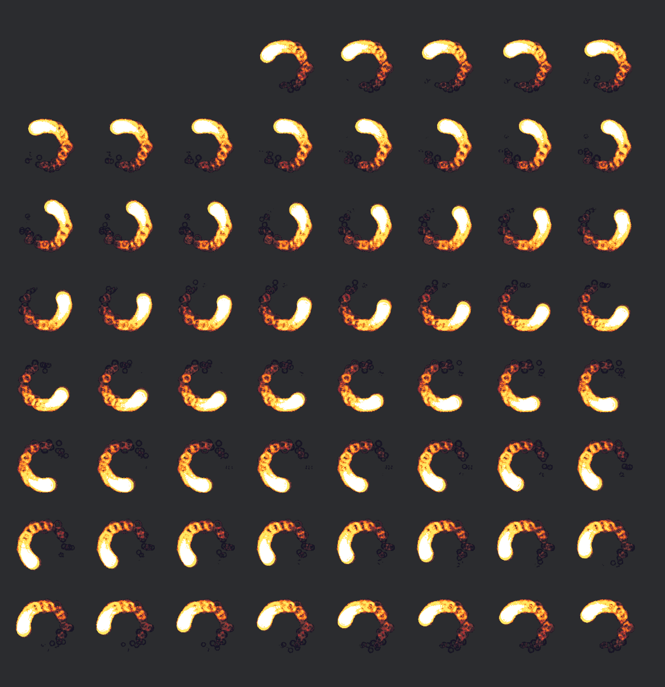
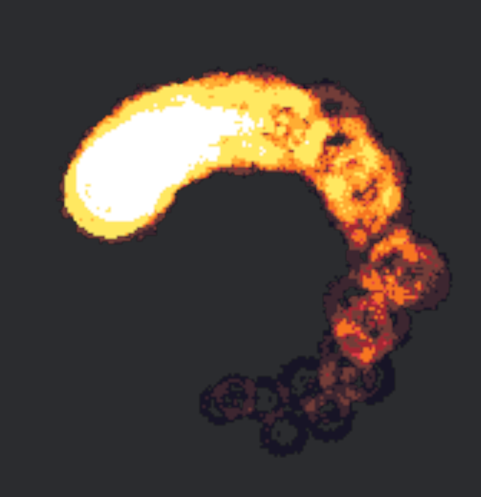

{{#include ../include/header012.md}}

# Flipbook
Based off of [Flipbook Animation - UE4 Materials 101 - Episode 5](https://www.youtube.com/watch?v=ZWAF_f2aP9s&list=PL78XDi0TS4lFlOVKsNC6LR4sCQhetKJqs&index=5) by Ben Cloward.  
  
A flipbook is simply the idea of having a spritesheet and animating it.  
  
Note: Bevy already has code for sprite sheet animations in 2D, see [2D rendering / Sprite Sheet](https://bevyengine.org/examples/2D%20Rendering/sprite-sheet/).  

Let's use [OpenGameArt - Fire Circle FX](https://opengameart.org/content/fire-circle-fx) as our test image.  
Dump whichever one you want to use into `assets/`. I chose the 200x200 version.

First, hook it up to your material like in [Texture](../frag/texture.md). I'm going with a plane, it makes the most sense for a particle-like effect.


(Upside down due to how my camera is setup, I think)  


The first step is that we want a single frame to take up the entire face of the plane. So we want to use smaller uv coordinates rather than the full 0-1 range.
But how much do we divide the uv by? Well, the number of rows and columns!

```c
@group(1) @binding(0) var<uniform> base_color: vec4<f32>;
@group(1) @binding(1) var base_color_texture: texture_2d<f32>;
@group(1) @binding(2) var base_color_sampler: sampler;

fn flipbook(uv: vec2<f32>, count: vec2<u32>) -> vec2<f32> {
    let c = vec2<f32>(f32(count.x), f32(count.y));
    return uv * (1.0 / c);
}

@fragment
fn fragment(in: VertexOutput) -> @location(0) vec4<f32> {
    let uv = flipbook(in.uv, vec2<u32>(u32(8), u32(8)));
    return textureSample(base_color_texture, base_color_sampler, uv) * base_color;
}
```



<!-- TODO: I don't completely understand the interpolation, but maybe you could do the flipbook logic in the vertex shader so it only gets the small uv range and interpolates between them, thus avoiding some calculations? -->

But two things. We should pass those numbers in from the outside! Let's avoid making a super-specialized shader when there's no reason to do so.  
The second is that we can do the conversion to `f32` and the `1.0 / c` from the outside! Currently we're having to do those cheap calculations for every single fragment, which isn't much but it adds up. You won't notice it at all, but it's good to get into the habit of not doing unnecessary work.

<!-- TODO: is there a way to let them do a struct but then map the values later? -->
Let's make our material structure have a builder function
```rust
    material: cmaterials.add(CustomMaterial::new(
        Color::WHITE,
        asset_server.load("fire_circles_200x200.png"),
        Vec2::new(8.0, 8.0),
    )),
// ...

#[derive(Asset, TypePath, AsBindGroup, Debug, Clone)]
pub struct CustomMaterial {
    #[uniform(0)]
    base_color: Color,
    #[texture(1)]
    #[sampler(2)]
    texture: Handle<Image>,
    /// Size in number of columns and rows, but altered to be `1.0 / size`
    #[uniform(3)]
    inverse_size: Vec2,
}
impl CustomMaterial {
    pub fn new(base_color: Color, texture: Handle<Image>, size: Vec2) -> Self {
        Self {
            base_color,
            texture,
            inverse_size: 1.0 / size,
        }
    }
}
```

```c
@group(1) @binding(0) var<uniform> base_color: vec4<f32>;
@group(1) @binding(1) var base_color_texture: texture_2d<f32>;
@group(1) @binding(2) var base_color_sampler: sampler;
@group(1) @binding(3) var<uniform> inv_size: vec2<f32>;

fn flipbook(uv: vec2<f32>, inv_size: vec2<f32>) -> vec2<f32> {
    return uv * inv_size;
}

@fragment
fn fragment(in: VertexOutput) -> @location(0) vec4<f32> {
    let uv = flipbook(in.uv, inv_size);
    return textureSample(base_color_texture, base_color_sampler, uv) * base_color;
}
```
It looks exactly the same but is marginally cheaper. Feels good.

Now we want to animate it! Add `#import bevy_pbr::mesh_view_bindings::globals` so we can get the time. You could also pass it in manually if you want.

TODO: this is broken
```c
fn flipbook(uv: vec2<f32>, inv_size: vec2<f32>, frame: f32) -> vec2<f32> {
    return fract((uv + frame) * inv_size);
}


@fragment
fn fragment(in: VertexOutput) -> @location(0) vec4<f32> {
    // We want the time to have a period of 1.5, so we do a hacky modulo
    let period = 1.5;
    let frame_rate = 4.0;
    
    let period_time = globals.time - floor(globals.time / 1.5) * 1.5;
    let frame_time = period_time * frame_rate;

    let frame_x = floor(frame_time);
    let frame_y = floor(frame_time * inv_size.x);

    let uv = flipbook(in.uv, inv_size, frame);
    return textureSample(base_color_texture, base_color_sampler, uv) * base_color;
}
```
This looks correct! It is spinning! Looks cool right? 

// webm
<video controls autoplay loop>
    <source src="../images/fire3.webm" type="video/webm">
</video>


Well, think back to how big the spritesheet was. This can't be correct! There's 8x8=64 images but it feels like we're doing maybe 8 images in total with how steppy it is.  
The issue is that we're going diagonally.